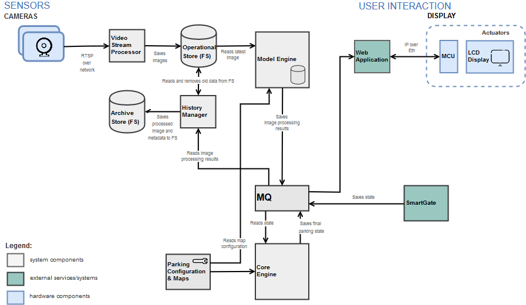
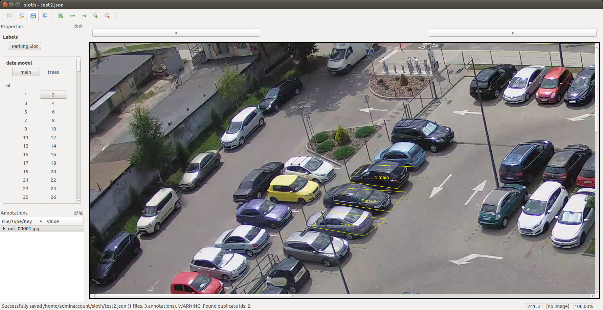

# SMART PARKING

Smart Parking project allows analyzing parking availability via IP cameras video stream. One or more cameras can be installed at the open area (authorized parking or free parking) and ML models will process the video stream and analyze each parking slot availability.

Instructions below provide a detailed description of how to run a demo version of the application, as well as how to train your custom model and apply the solution to your custom parking.  

1. [Getting Started](#gettingstarted1)
2. [How to Run Smart Parking as a Demo (Use Default Parking Map)](#rundemo)
3. [How to Run Smart Parking with Your Own Parking Map](#runownparking)
4. [External Integrations](#externalintegrations)
5. [Configuration](#configuration1)
6. [Contributing](#contributing)
7. [License](#license)

The diagram below represents a high-level architecture.




## <a name="gettingstarted1"></a>Getting Started

All commands and scripts below are for Ubuntu, but they may be easily adopted for any
other Linux.

1\. Clone Git repository:

If needed, install `git` and `git-lfs`:

```
sudo apt-get install git -y
curl -s https://packagecloud.io/install/repositories/github/git-lfs/script.deb.sh | sudo bash
sudo apt-get install git-lfs -y
```

Run:

```
git clone https://github.com/SoftServeInc/smartparking.git
cd smartparking
git lfs install
```

Please note that large model files are stored on Git LFS because of their size.

2\. Install Docker and setup a cron to clean up the archive directory:

```
sudo ./install.sh
```

Please note that the script needs sudo.

By default `clean_archive_dir` cron deletes from the archive directory all files older
than 192 hours (8 days).  If needed, you can replace `192` with any other number of hours
by changing the cron manually:

```
sudo crontab -e
```

If you have other OS than Ubuntu, see
https://docs.docker.com/install/#server and https://docs.docker.com/compose/install/.

Log out and log back in so that your group membership is re-evaluated.  Run:

```
groups
```

`docker` group should be in the list.

If for some reason it is not in the list yet (you may experience this issue
on Ubuntu 18), run:

```
newgrp docker
```

To verify your installation and user permissions, run:

```
docker run hello-world
```

Now you can either use default or create your own parking map - see the appropriate
sections below.

## <a name="rundemo"></a>How to Run Smart Parking as a Demo (Use Default Parking Map)

This is the case when you are interested just in a demo and don't plan to use
it with your real parking.  Instead of a real camera you will use a fake video
server that streams a sample video in a loop.

There is a possibility to run the solution with two separate cameras
(a case when one camera is not able to cover the whole parking) - see details
below.

### <a name="models1"></a>Models

There are two default models:

- `main`: main model
- `behind_trees`: additional model for cars behind trees

Please note that `behind_trees` model was created to handle a particular edge case
on our parking and probably will not be very useful in other cases.

### <a name="running1"></a>Running Everything Up

To run everything locally (for one camera), go to `smartparking` folder and run:

```
./run_locally.sh
```

For two cameras (in our case, two fake video servers), run:

```
./2c_run_locally.sh
```

By default, logging level for all Python applications is `INFO`, but if needed
you can change it in `docker-compose.dev.yml`.

Wait a few minutes and verify that everything runs correctly:

1\. Run:

```
docker ps
```

For one camera, you should see 6 containers like:

```
CONTAINER ID        IMAGE                        COMMAND                  CREATED             STATUS              PORTS                                          NAMES
370b7ff70926        history-manager:1.0          "python history_mana…"   About an hour ago   Up About a minute                                                  history-manager
125566ec5243        core-engine:1.0              "python core_engine/…"   About an hour ago   Up About a minute                                                  core-engine
0123070f024e        model:1.0                    "python3 model_wrapp…"   About an hour ago   Up About a minute                                                  model
9f7fb5ee514b        video-stream-processor:1.0   "python ffmpeg_launc…"   About an hour ago   Up About a minute                                                  video-stream-processor
1a6efb41ef6e        mosquitto:1.0                "/docker-entrypoint.…"   About an hour ago   Up About a minute   0.0.0.0:1883->1883/tcp                         mosquitto
e5f6924848e9        video-server:1.0             "/entrypoint.sh"         4 days ago          Up 2 minutes        0.0.0.0:554->554/tcp, 0.0.0.0:8090->8090/tcp   video-server
```

For two cameras, you should see 10 containers like:

```
CONTAINER ID        IMAGE                        COMMAND                  CREATED             STATUS                 PORTS                                          NAMES
b72b4d56af1a        core-engine:1.0              "python core_engine/…"   13 seconds ago      Up 10 seconds                                                         core-engine
c51d03130da3        history-manager:1.0          "python history_mana…"   13 seconds ago      Up 10 seconds                                                         history-manager1
bf15a3459afc        history-manager:1.0          "python history_mana…"   15 seconds ago      Up 11 seconds                                                         history-manager2
fa102aca4ce2        model:1.0                    "python3 model_wrapp…"   29 seconds ago      Up 26 seconds                                                         model2
320be6dafecc        model:1.0                    "python3 model_wrapp…"   29 seconds ago      Up 24 seconds                                                         model1
7d987147ac6c        video-stream-processor:1.0   "python ffmpeg_launc…"   42 seconds ago      Up 39 seconds                                                         video-stream-processor1
5633a04a37d6        video-stream-processor:1.0   "python ffmpeg_launc…"   42 seconds ago      Up 39 seconds                                                         video-stream-processor2
c0c7a83d6c53        mosquitto:1.0                "/docker-entrypoint.…"   9 minutes ago       Up 9 minutes           0.0.0.0:1883->1883/tcp                         mosquitto
f25cffef805b        video-server:1.0             "/entrypoint.sh"         11 minutes ago      Up 11 minutes          0.0.0.0:556->554/tcp, 0.0.0.0:8092->8090/tcp   video-server2
1c205e6e15e0        video-server:1.0             "/entrypoint.sh"         11 minutes ago      Up 11 minutes          0.0.0.0:555->554/tcp, 0.0.0.0:8091->8090/tcp   video-server1
```

2\. Navigate to `/opt/data/images_output` folder (for two cameras it will
contain additional subfolders `camera1` and `camera2`) and open the last subfolder
there (if there are more than one).  Each several seconds a new `jpg` image
should appear and older ones should disappear.

3\. Navigate to `/opt/data/images_archive` folder (for two cameras it will
contain additional subfolders `camera1` and `camera2`).  Each several seconds
a new `jpg` image and `json` file should appear.

4\. Verify `model` output to Mosquitto:

```
mosquitto_sub -t '<topic name>' -h 127.0.0.1 -p 1883
```

For one camera the topic name is `/plugins/video`, for two cameras -
`/plugins/video/camera1` and `/plugins/video/camera2`.

Each several seconds you should see a new output like:

```
{"parking": {"free": 9, "occupied": 92}, "parking_places": {"1": [1, "1.0"], "2": [1, "1.0"], "3": [1, "1.0"], "4": [1, "1.0"], "5": [1, "0.99999845"], "6": [1, "1.0"], "7": [1, "1.0"], "8": [1, "1.0"], "9": [1, "1.0"], "10": [0, "2.8769427e-06"], "11": [0, "9.3027205e-07"], "12": [0, "2.36244e-05"], "13": [0, "1.4202287e-06"], "14": [0, "6.4344767e-06"], "15": [0, "1.475735e-05"], "16": [0, "2.0916807e-05"], "17": [1, "1.0"], "18": [0, "1.6452737e-05"], "19": [0, "2.027849e-06"], "20": [1, "1.0"], "21": [1, "1.0"], "22": [1, "1.0"], "23": [1, "1.0"], "24": [1, "1.0"], "25": [1, "1.0"], "26": [1, "1.0"], "27": [1, "1.0"], "28": [1, "1.0"], "29": [1, "1.0"], "30": [1, "0.9999999"], "31": [1, "0.99999607"], "32": [1, "1.0"], "33": [1, "1.0"], "34": [1, "1.0"], "35": [1, "1.0"], "36": [1, "1.0"], "37": [1, "0.9999995"], "38": [1, "0.9999987"], "39": [1, "0.9999989"], "40": [1, "1.0"], "41": [1, "1.0"], "42": [1, "1.0"], "43": [1, "0.9999646"], "44": [1, "1.0"], "45": [1, "1.0"], "46": [1, "1.0"], "47": [1, "0.9999999"], "48": [1, "0.99999976"], "49": [1, "0.9999999"], "50": [1, "1.0"], "51": [1, "1.0"], "52": [1, "1.0"], "53": [1, "1.0"], "54": [1, "1.0"], "55": [1, "1.0"], "56": [1, "1.0"], "57": [1, "0.99999917"], "58": [1, "1.0"], "59": [1, "1.0"], "60": [1, "1.0"], "61": [1, "1.0"], "62": [1, "1.0"], "63": [1, "0.9999989"], "64": [1, "1.0"], "65": [1, "1.0"], "66": [1, "1.0"], "67": [1, "1.0"], "68": [1, "1.0"], "69": [1, "1.0"], "70": [1, "1.0"], "71": [1, "1.0"], "72": [1, "1.0"], "73": [1, "1.0"], "74": [1, "1.0"], "75": [1, "1.0"], "76": [1, "1.0"], "77": [1, "1.0"], "78": [1, "1.0"], "79": [1, "1.0"], "80": [1, "0.9999999"], "81": [1, "1.0"], "82": [1, "1.0"], "83": [1, "0.9999989"], "84": [1, "1.0"], "85": [1, "1.0"], "86": [1, "1.0"], "87": [1, "1.0"], "88": [1, "0.99995553"], "89": [1, "1.0"], "90": [1, "1.0"], "91": [1, "1.0"], "92": [1, "1.0"], "93": [1, "1.0"], "94": [1, "1.0"], "95": [1, "1.0"], "96": [1, "1.0"], "97": [1, "1.0"], "98": [1, "1.0"], "99": [1, "1.0"], "100": [1, "1.0"], "101": [1, "1.0"]}, "metadata": {"processing_time": "17572.69 ms", "source_folder": "2019-06-04T16:26:12.022965", "processing_start_time": "2019-06-04 16:41:00.609", "source_file": "out_00056.jpg"}}
```

5\. Verify `core_engine` output to Mosquitto:

```
mosquitto_sub -t '/engine' -h 127.0.0.1 -p 1883
```

Each several seconds you should see a new output like:

```
{"parking": {"free": 29, "occupied": 72, "in_movement": 0, "free_to_display": 8}, "parking_places": [{"id": "1", "status": [1, 1.0, 3]}, {"id": "2", "status": [1, 1.0]}, {"id": "3", "status": [1, 1.0]}, {"id": "4", "status": [1, 1.0]}, {"id": "5", "status": [1, 1.0]}, {"id": "6", "status": [1, 1.0]}, {"id": "7", "status": [1, 1.0]}, {"id": "8", "status": [1, 1.0]}, {"id": "9", "status": [1, 1.0]}, {"id": "10", "status": [0, 0.0, 3]}, {"id": "11", "status": [0, 0.0, 3]}, {"id": "12", "status": [0, 0.0, 3]}, {"id": "13", "status": [0, 0.0, 3]}, {"id": "14", "status": [0, 0.0, 3]}, {"id": "15", "status": [0, 0.0, 3]}, {"id": "16", "status": [0, 0.0, 3]}, {"id": "17", "status": [1, 1.0, 3]}, {"id": "18", "status": [0, 0.0, 4]}, {"id": "19", "status": [0, 0.0, 4]}, {"id": "20", "status": [1, 1.0]}, {"id": "21", "status": [1, 1.0]}, {"id": "22", "status": [0, 0.0]}, {"id": "23", "status": [1, 1.0]}, {"id": "24", "status": [1, 1.0]}, {"id": "25", "status": [1, 1.0]}, {"id": "26", "status": [1, 1.0]}, {"id": "27", "status": [1, 1.0]}, {"id": "28", "status": [1, 1.0]}, {"id": "29", "status": [1, 1.0]}, {"id": "30", "status": [1, 1.0]}, {"id": "31", "status": [1, 1.0]}, {"id": "32", "status": [1, 1.0]}, {"id": "33", "status": [1, 1.0]}, {"id": "34", "status": [1, 1.0]}, {"id": "35", "status": [1, 1.0]}, {"id": "36", "status": [1, 1.0]}, {"id": "37", "status": [1, 1.0]}, {"id": "38", "status": [1, 1.0]}, {"id": "39", "status": [1, 1.0]}, {"id": "40", "status": [1, 1.0]}, {"id": "41", "status": [1, 1.0]}, {"id": "42", "status": [1, 1.0]}, {"id": "43", "status": [1, 1.0]}, {"id": "44", "status": [1, 1.0]}, {"id": "45", "status": [1, 1.0]}, {"id": "46", "status": [1, 1.0]}, {"id": "47", "status": [0, 0.0]}, {"id": "48", "status": [1, 1.0]}, {"id": "49", "status": [1, 1.0]}, {"id": "50", "status": [1, 1.0]}, {"id": "51", "status": [1, 1.0]}, {"id": "52", "status": [1, 1.0]}, {"id": "53", "status": [1, 1.0]}, {"id": "54", "status": [1, 1.0]}, {"id": "55", "status": [1, 1.0]}, {"id": "56", "status": [0, 0.0]}, {"id": "57", "status": [0, 0.0]}, {"id": "58", "status": [1, 1.0]}, {"id": "59", "status": [1, 1.0]}, {"id": "60", "status": [1, 1.0]}, {"id": "61", "status": [1, 1.0]}, {"id": "62", "status": [1, 1.0]}, {"id": "63", "status": [1, 1.0]}, {"id": "64", "status": [1, 1.0]}, {"id": "65", "status": [0, 0.0]}, {"id": "66", "status": [1, 1.0]}, {"id": "67", "status": [0, 0.0]}, {"id": "68", "status": [0, 0.0]}, {"id": "69", "status": [1, 1.0]}, {"id": "70", "status": [1, 1.0]}, {"id": "71", "status": [1, 1.0]}, {"id": "72", "status": [1, 1.0]}, {"id": "73", "status": [1, 1.0]}, {"id": "74", "status": [1, 1.0]}, {"id": "75", "status": [1, 1.0]}, {"id": "76", "status": [1, 1.0]}, {"id": "77", "status": [1, 1.0]}, {"id": "78", "status": [1, 1.0]}, {"id": "79", "status": [1, 1.0]}, {"id": "80", "status": [1, 1.0]}, {"id": "81", "status": [1, 1.0]}, {"id": "82", "status": [1, 1.0]}, {"id": "83", "status": [0, 0.0]}, {"id": "84", "status": [1, 1.0]}, {"id": "85", "status": [1, 1.0]}, {"id": "86", "status": [1, 1.0]}, {"id": "87", "status": [1, 1.0]}, {"id": "88", "status": [1, 1.0]}, {"id": "89", "status": [1, 1.0]}, {"id": "90", "status": [1, 1.0]}, {"id": "91", "status": [1, 1.0]}, {"id": "92", "status": [1, 1.0]}, {"id": "93", "status": [1, 1.0]}, {"id": "94", "status": [1, 1.0]}, {"id": "95", "status": [1, 1.0]}, {"id": "96", "status": [1, 1.0]}, {"id": "97", "status": [1, 1.0]}, {"id": "98", "status": [1, 1.0]}, {"id": "99", "status": [1, 1.0]}, {"id": "100", "status": [1, 1.0]}, {"id": "101", "status": [1, 1.0]}], "metadata": {"processing_time": "16006.17 ms", "source_folder": "2019-06-04T16:26:12.022965", "processing_start_time": "2019-06-04 16:42:55.412", "source_file": "out_00064.jpg", "core_engine_activation_time": 1559666591.5138526, "static_metadata": {"parking_title": "Default Parking"}}}
```

Last one is basically the output of the whole application:

- Overall parking statistics: number of free and occupied slots and cars "in movement"
  (see [Smart Gate](#smartgate1) section for details).  `free_to_display` value takes
  into account "reserved" slots (see [Parking Slots Reservation](#reservation1) section
  for details).
- Status of each individual state in the following format:

  ```
  [<binary parking slot status: 0 - free, 1 - occupied>, <exact probability in the range 0..1 that the slot is occupied>]
  ```

Now you are all set.  To stop all containers (for one camera), run:

```
docker stop video-server mosquitto video-stream-processor model history-manager core-engine
```

For two cameras, run:

```
docker stop video-server1 video-server2 mosquitto video-stream-processor1 video-stream-processor2 model1 model2 history-manager1 history-manager2 core-engine
```

## <a name="runownparking"></a>How to Run Smart Parking with Your Own Parking Map

This is the case when you want to use it with your real parking.

There is a possibility to run the solution with two separate cameras
(a case when one camera is not able to cover the whole parking) - see details
below.

### Pre-Requisites

Any IP camera or two cameras that output ffmpeg stream.  For default parking map and
models the following camera was used: Dahua DH-IPC-HFW5830EP-Z (8MP, 3840х2160).

Your cameras may have any resolution, but larger is better.  Default models were trained
on parking slots with the original size around 160x80 pixels.  Also please note that
the models convert any parking slot image into a square 128x128 pixels.

The cameras should be located above the parking in some defined positions that
won't change.  To get started you don't need the actual video streams, but you
need several screenshots (at least three, but more is better).  Try to choose
shots with the different composition of free/occupied parking slots.

### Parking Map

Now you need to create parking maps (one for each camera).

1\. Take a good representative shot from the camera.  See shot of the default
parking as an example: `sloth/parking_map.jpg`.

2\. Go to `smartparking` folder.

3\. Install Sloth application (please note that it has GUI):

#### Ubuntu

```
./install_sloth.sh <path to a folder where you want to install Sloth>
```

For example:

```
./install_sloth.sh ~/sloth
```

Please note that the script uses sudo.

#### MacOS

Install Anaconda:

```
https://docs.anaconda.com/anaconda/install/mac-os/
```

Create a new Python 2 environment and activate it:

```
conda create -n sloth python=2.7
source activate sloth
```

Install PyQt4:

```
conda install pyqt=4.11.4
```

Install Pillow:

```
pip install pillow
```

4\. Run Sloth:

```
sloth --config <path to your Sloth folder>/smartparking.py
```

For example:

```
sloth --config ~/sloth/smartparking.py
```

5\. Click `Add Image` icon at the top and select your image from camera.  The
file name will appear in `Annotations` table at the left.  Click it there to
display the image.

6\. Draw your parking slots.  Click `Parking Slot` label at the left.  For each
parking slot choose the model (either `main` or `behind_trees` by default) and the slot
id (up to 500 by default).  `main` model is suitable for most situations, but
if a parking slot is hidden behind tree branches, `behind_trees` model may work better.
If you plan to use your own models, open `smartparking.py` and edit the list
around line 10.  If you need more than 500 ids, edit the range around line 9.

Please note that at this point you should already have a vision which model
will cover which parking slots.  You don't need to have trained model(s) themselves,
you just need to have some defined names.  If all parking slots look similar,
then you probably need just one model and you can leave default name `main`.  If
you don't plan to use `behind_trees` model, you can remove it from Sloth configuration
(see `smartparking.py` around line 10).

After you selected the model and slot id, draw a polygon on the image. Make
sure it has 4 vertices.  You may finish the polygon either by double-click or
by pressing Enter.  If the polygon doesn't have exactly 4 vertices or the model
and slot id were not selected, it will disappear from the screen.  If
succeeded, choose the next slot id and draw another polygon, etc.

7\. When done, click `Save` icon at the top and choose the output file name (make
sure it has `json` extension).  If there were duplicates slot ids, a warning
at the bottom will be displayed, but the file will be saved anyway.

You can fix duplicate slot ids either in Sloth itself or by editing the output
file manually.

See default parking map as an example: `sloth/pklot_config.json`.



### Sample Video

To get started you can setup a video server and stream a sample video (instead of
using a real camera).  If you have already made several representative shots,
just glue them together to make a short slide-show video (to be looped by the video server).
Make sure that the file has `mp4` extension.

For example, you can use 4K Slideshow Maker: https://www.4kdownload.com/products/product-slideshowmaker.
It's free and available on various platfroms including Windows, macOs and Ubuntu.  Make
sure that you configured it correctly (click Preferences button at the top):

- Transition Duration: 0
- Apply Ken Burns effect: unchecked
- Video Format: 4K Ultra HD

Put your video as `sample.mp4` in `video_server/data` folder (overwrite or rename
existing `sample.mp4` file).

Go to `smartparking` folder and run:

```
docker-compose -f docker-compose.yml -f docker-compose.dev.yml up --build -d video-server
```

To verify the stream you can open URL http://localhost:8090/sample.mp4 in any video
player like SMPlayer.

To install SMPlayer, run the following:

```
sudo add-apt-repository ppa:rvm/smplayer
sudo apt-get update
sudo apt-get install smplayer -y
smplayer
```

To stop the video server run:

```
docker stop video-server
```

### Models

You can start with two default models - see [Models](#models1) section above for details.

If you are going to use them for prediction, please note that they were trained on parking
slots with the original size around 160x80 pixels.

If you are going to train your own model(s), proceed to the steps below.

Please note, there is no direct relation between the number of cameras and the number
of models: both cameras may use the same model, or each camera may have its own model,
or you may have several models shared beween different cameras.

### Data Preparation

You need these steps only if you plan to train your own model(s).

1\. Make raw images:

Make **tons** of shots (more is better) by your camera with different parking configuration.
Consider making shots with different sun position (in the morning, in the evening or even in the
night, if needed) and different weather conditions (rain, snow, fog, etc.)

In fact, this is the most important step and it may be challenging to make it right.  First, you
need to clearly understand time of the day, when the parking is used.  Next, you need to take into
account all possible lighting levels multiplied by all weather conditions that might affect the images.
Please note, that in winter it becomes dark much earlier than in summer.  Make sure that you
have enough images of each type (at least 1,000).

Also make sure that each parking slot appears in both free and occupied state on each type
of image.  Ideally to have equal number of those images.

2\. Go to `smartparking` folder.

3\. Install required dependencies and setup virtual environment:

```
./install_model.sh
```

Please note that the script uses sudo.

Next time to run the scripts below, you will need to execute:

```
source venv/bin/activate
```

4\. Split raw images to individual parking slots:

```
python3 model/split_raw_images.py -i <path to input folder with raw images> -o <path to output folder with cropped slot images> -c <path to parking configuration json>
```

For example:

```
python3 model/split_raw_images.py -i ~/raw_images -o ~/cropped_images -c sloth/pklot_config.json
```

The script will put cropped images into the output folder.  It will create a subfolder for each model
found in the configuration file like:

```
behind_trees
main
```

5\. Classify images as free or occupied:

There are several options here, but somehow or other you need to classify all cropped images
obtained on the previous step.  For each model folder you need to create the following subfolders:

```
free
occupied
```

First option is to classify all images manually, by visual inspection.  It's the easiest
but the most time consuming option.

Second option is to classify images using default models (`main` and/or `behind_trees`).
When finished, you will still need to review all results and to manually move incorrectly
classified images from one folder to another.  Number of errors will be related to the degree
of similarity between the models and your data.

To do that, run:

```
python3 model/classify_images.py -i <path to input folder with cropped images for a particular model> -o <path to output folder with classified images for the model (`free` and `occupied` subfolders will be created there)> -m <path to the model folder (default models live in `model/trained_models`)>
```

For example:

```
python3 model/classify_images.py -i ~/cropped_images/my_model -o ~/classified_images/my_model -m model/trained_models/main
```

Third option is to classify a small subset if images using one of the options above, train a
preliminary model on that small subset (see the steps below) and classify the rest of images using
that preliminary model.  Depending on your data this option may require less manual correction
than the second option above.

### Training Models

You need these steps only if you plan to train your own model(s).

1\. Go to `smartparking` folder.

2\. Split classified images into training and validation sets:

For each model, run:

```
python3 model/split_dataset.py -i <path to input folder with classified images for a particular model (`free` and `occupied` subfolders must exist there)> -o <path to output folder for the model (`training` and `validation` subfolders will be created there)>
```

For example:

```
python3 model/split_dataset.py -i ~/classified_images/my_model -o ~/dataset/my_model
```

Two subfolders will be created in the output folder:

```
training
validation
```

Each of subfolders above will still include two subfolders from the previous step:

```
free
occupied
```

The script will try to randomly split input data in 80-20 proportion (include 80% of images into `training`
and 20% of images into `validation` sets).  It will follow these rules:

- `validation` set contains 50% of `free` and 50% of `occupied` images
- `training` set contains no less than 17.5% (~1/6) of `free` and `occupied` images.

If there is not enough `free` or `occupied` images (less than 24%), the script will display a warning
and propose possible solutions:

- Manually fix existing dataset.  Available options include:

  - Make additional camera shots to add more images of a certain type.
  - Do manual undersampling: if there are lots of images that look almost identical, you can manually remove some
  images to fix the data skew.
  - Do manual oversampling: duplicate some images to increase total number of images of certain type.
  To do that you can use the following script:
    
    ```
    python3 model/duplicate_images.py -n <number of copies> -f <file 1> <file 2> ...
    ```
    
    For example:

    ```
    python3 model/duplicate_images.py -n 2 -f ~/classified_images/my_model/free/free1.jpg ~/classified_images/my_model/free/free2.jpg
    ```

    It will create additional files like:

    ```
    ~/classified_images/my_model/free/free1_copy_1.jpg
    ~/classified_images/my_model/free/free1_copy_2.jpg
    ~/classified_images/my_model/free/free2_copy_1.jpg
    ~/classified_images/my_model/free/free2_copy_2.jpg
    ```

- Do automatic oversampling and reduce `validation` size (if needed).  To do that pass `-a` into `split_dataset.py`.
For example:

  ```
  python3 model/split_dataset.py -i ~/classified_images/my_model -o ~/dataset/my_model -a  
  ```

  Even if you plan to use automatic oversampling, you still need at least 10 images of each type,
  otherwise the script will throw an error (as already mentioned above, it is suggested to have at least 1,000 images of each type).

  The script will apply the following rules:
  
  - At least 24% of images of some type: put 10% (of all images) of each type into `validation` and everything else into `training`.
  - At least 12% of some type: put 10% (of all images) of that type into `validation`, oversample remaining images to obtain 17.5% of `training`.
  That will reduce a size of `validation` set.
  - At least 4% of some type: oversample 2% (of all images) of that type to obtain 17.5% of `training`, put remaining images into `validation`
  (and the same number of images of another type).  That will reduce a size of `validation` set.
  - Less than 4% of some type: put half of the images into `validation` (and the same number of images of another type), oversample remaining
  images to obtain 17.5% of `training`.  That will reduce a size of `validation` set.

3\. Train the models:

For each model, run:

```
python3 model/train_model.py -i <path to dataset folder for a particular model (`training` and `validation` subfolders must exist there)> -o <path to output folder for the model>
```

For example:

```
python3 model/train_model.py -i ~/dataset/my_model -o model/trained_models/my_model
```

In the output folder the script will create the following:

- `model.json`: architecture of the neural network
- `weights.h5`: weights
- `misclassified/`: folder with all images from `validation` sets, which were not classified correctly

Review all misclassified images.  If the model can't recognize some particular image patterns,
you can review your `training` set to make sure there are enough images like the misclassified one.
If needed, do oversampling of "rare" images using `duplicate_images.py` (see above).  Make sure that
you never put exactly the same images into both `training` and `validation` sets.

In the future you might want to improve existing model by training it on a new data.
In that case you don't need to train the model from scratch, you can retrain it using
existing model as a starting point:

```
python3 model/train_model.py -i <path to dataset folder (must contain both old and new images)> -o <path to output folder for the new model> -m <path to existing model folder>
```

For example:

```
python3 model/train_model.py -i ~/dataset/my_model -o model/trained_models/my_model_new -m model/trained_models/my_model
```

If you want to test the model on an additional dataset, run the following script:

```
python3 model/test_model.py -i <path to input folder with classified images (`free` and `occupied` subfolders must exist there)> -o <path to output folder for misclassified images> -m <path to the model folder>
```

For example:

```
python3 model/test_model.py -i ~/additional_dataset/ -o ~/misclassified/ -m model/trained_models/my_model
```

In will put all misclassified images in a new folder.

### Running Everything Up

To run everything locally, follow these steps:

1\. For one camera, put your parking configuration as
`model/pklot_configurations/pklot_config.json`.  For two cameras, put the files
as `model/pklot_configurations/2c/camera1/pklot_config.json` and
`model/pklot_configurations/2c/camera2/pklot_config.json`.

2\. Put your actual model(s) into `model/trained_models/` folder, each model
in a separate subfolder following this structure:

```
trained_models/
  <model name 1>/
    model.json  # architecture of the neural network
    weights.h5  # weights
  ...
```

3\. See [Running Everything Up](#running1) section above.  It assumes using
fake video server(s) configured above.

When you are ready to run it on a dedicated ("production") environment with a real camera,
follow these steps:

1\. Follow instructions from [Getting Started](#gettingstarted1) section above.

2\. Additionally install Supervisor:

```
sudo apt-get install supervisor -y
```

3\. Change default configuration.  See [Configuration](#configuration1) section below
for explanation of all configuration values.  Most of them should be fine, but
you need to set at least two things:

- `video_url` in `video_stream_processor/configurations/config.prod.json` pointing it
  to the stream of your real camera.  If you have two cameras, update
  `video_stream_processor/2c/camera1/configurations/config.prod.json` and
  `video_stream_processor/2c/camera2/configurations/config.prod.json`.
- List of "reserved" parking slots in `core_engine/configurations/reservation.prod.json`.
  See [Parking Slots Reservation](#reservation1) section below for details.

4\. Put your parking configuration as `model/pklot_configurations/pklot_config.json`.
If you have two cameras, put the files as
`model/pklot_configurations/2c/camera1/pklot_config.json` and
`model/pklot_configurations/2c/camera2/pklot_config.json`.
Please note that the file(s) are being periodically reloaded (each hour by default),
so you can update them on the host on the fly, instead of restarting containers.

5\. Put your actual model(s) into `model/trained_models/` folder, each model
in a separate subfolder following this structure:

```
trained_models/
  <model name 1>/
    model.json  # architecture of the neural network
    weights.h5  # weights
  ...
```

6\. Run (for one camera):

```
./run_production.sh
```

For two cameras, run:

```
./2c_run_production.sh
```

By default, logging level for all Python applications is `INFO`, but if needed
you can change it in `docker-compose.prod.yml`.

Wait a few minutes and verify that everything runs correctly:

1\. Run:

```
supervisorctl status
```

For one camera, you should see 5 containers like:

```
core-engine                      RUNNING   pid 115263, uptime 0:02:35
history-manager                  RUNNING   pid 115262, uptime 0:02:35
model                            RUNNING   pid 115261, uptime 0:02:35
mosquitto                        RUNNING   pid 115259, uptime 0:02:35
video-stream-processor           RUNNING   pid 122146, uptime 0:02:35
```

For two cameras, you should see 8 containers like:

```
core-engine                      RUNNING   pid 115263, uptime 0:02:35
history-manager1                 RUNNING   pid 115264, uptime 0:02:35
history-manager2                 RUNNING   pid 115265, uptime 0:02:35
model1                           RUNNING   pid 115261, uptime 0:02:35
model2                           RUNNING   pid 115262, uptime 0:02:35
mosquitto                        RUNNING   pid 115259, uptime 0:02:35
video-stream-processor1          RUNNING   pid 122146, uptime 0:02:35
video-stream-processor2          RUNNING   pid 122147, uptime 0:02:35
```

2\. Run:

```
docker ps
```

For one camera, you should see 5 containers like:

```
CONTAINER ID        IMAGE                        COMMAND                  CREATED             STATUS              PORTS                    NAMES
370b7ff70926        history-manager:1.0          "python history_mana…"   About an hour ago   Up About a minute                            history-manager
125566ec5243        core-engine:1.0              "python core_engine/…"   About an hour ago   Up About a minute                            core-engine
0123070f024e        model:1.0                    "python3 model_wrapp…"   About an hour ago   Up About a minute                            model
9f7fb5ee514b        video-stream-processor:1.0   "python ffmpeg_launc…"   About an hour ago   Up About a minute                            video-stream-processor
1a6efb41ef6e        mosquitto:1.0                "/docker-entrypoint.…"   About an hour ago   Up About a minute   0.0.0.0:1883->1883/tcp   mosquitto
```

For two cameras, you should see 8 containers like:

```
CONTAINER ID        IMAGE                        COMMAND                  CREATED             STATUS                 PORTS                    NAMES
b72b4d56af1a        core-engine:1.0              "python core_engine/…"   13 seconds ago      Up 10 seconds                                   core-engine
c51d03130da3        history-manager:1.0          "python history_mana…"   13 seconds ago      Up 10 seconds                                   history-manager1
bf15a3459afc        history-manager:1.0          "python history_mana…"   15 seconds ago      Up 11 seconds                                   history-manager2
fa102aca4ce2        model:1.0                    "python3 model_wrapp…"   29 seconds ago      Up 26 seconds                                   model2
320be6dafecc        model:1.0                    "python3 model_wrapp…"   29 seconds ago      Up 24 seconds                                   model1
7d987147ac6c        video-stream-processor:1.0   "python ffmpeg_launc…"   42 seconds ago      Up 39 seconds                                   video-stream-processor1
5633a04a37d6        video-stream-processor:1.0   "python ffmpeg_launc…"   42 seconds ago      Up 39 seconds                                   video-stream-processor2
c0c7a83d6c53        mosquitto:1.0                "/docker-entrypoint.…"   9 minutes ago       Up 9 minutes           0.0.0.0:1883->1883/tcp   mosquitto
```

3\. Navigate to `/opt/data/images_output` folder (for two cameras it will
contain additional subfolders `camera1` and `camera2`) and open the last subfolder
there (if there are more than one).  Each several seconds a new `jpg` image
should appear and older ones should disappear.

4\. Navigate to `/opt/data/images_archive` folder (for two cameras it will
contain additional subfolders `camera1` and `camera2`).  Each several seconds
a new `jpg` image and `json` file should appear.

5\. Verify `model` output to Mosquitto:

```
mosquitto_sub -t '<topic name>' -h 127.0.0.1 -p 1883
```

For one camera the topic name is `/plugins/video`, for two cameras -
`/plugins/video/camera1` and `/plugins/video/camera2`.

Each several seconds you should see a new output like:

```
{"parking": {"free": 9, "occupied": 92}, "parking_places": {"1": [1, "1.0"], "2": [1, "1.0"], "3": [1, "1.0"], "4": [1, "1.0"], "5": [1, "0.99999845"], "6": [1, "1.0"], "7": [1, "1.0"], "8": [1, "1.0"], "9": [1, "1.0"], "10": [0, "2.8769427e-06"], "11": [0, "9.3027205e-07"], "12": [0, "2.36244e-05"], "13": [0, "1.4202287e-06"], "14": [0, "6.4344767e-06"], "15": [0, "1.475735e-05"], "16": [0, "2.0916807e-05"], "17": [1, "1.0"], "18": [0, "1.6452737e-05"], "19": [0, "2.027849e-06"], "20": [1, "1.0"], "21": [1, "1.0"], "22": [1, "1.0"], "23": [1, "1.0"], "24": [1, "1.0"], "25": [1, "1.0"], "26": [1, "1.0"], "27": [1, "1.0"], "28": [1, "1.0"], "29": [1, "1.0"], "30": [1, "0.9999999"], "31": [1, "0.99999607"], "32": [1, "1.0"], "33": [1, "1.0"], "34": [1, "1.0"], "35": [1, "1.0"], "36": [1, "1.0"], "37": [1, "0.9999995"], "38": [1, "0.9999987"], "39": [1, "0.9999989"], "40": [1, "1.0"], "41": [1, "1.0"], "42": [1, "1.0"], "43": [1, "0.9999646"], "44": [1, "1.0"], "45": [1, "1.0"], "46": [1, "1.0"], "47": [1, "0.9999999"], "48": [1, "0.99999976"], "49": [1, "0.9999999"], "50": [1, "1.0"], "51": [1, "1.0"], "52": [1, "1.0"], "53": [1, "1.0"], "54": [1, "1.0"], "55": [1, "1.0"], "56": [1, "1.0"], "57": [1, "0.99999917"], "58": [1, "1.0"], "59": [1, "1.0"], "60": [1, "1.0"], "61": [1, "1.0"], "62": [1, "1.0"], "63": [1, "0.9999989"], "64": [1, "1.0"], "65": [1, "1.0"], "66": [1, "1.0"], "67": [1, "1.0"], "68": [1, "1.0"], "69": [1, "1.0"], "70": [1, "1.0"], "71": [1, "1.0"], "72": [1, "1.0"], "73": [1, "1.0"], "74": [1, "1.0"], "75": [1, "1.0"], "76": [1, "1.0"], "77": [1, "1.0"], "78": [1, "1.0"], "79": [1, "1.0"], "80": [1, "0.9999999"], "81": [1, "1.0"], "82": [1, "1.0"], "83": [1, "0.9999989"], "84": [1, "1.0"], "85": [1, "1.0"], "86": [1, "1.0"], "87": [1, "1.0"], "88": [1, "0.99995553"], "89": [1, "1.0"], "90": [1, "1.0"], "91": [1, "1.0"], "92": [1, "1.0"], "93": [1, "1.0"], "94": [1, "1.0"], "95": [1, "1.0"], "96": [1, "1.0"], "97": [1, "1.0"], "98": [1, "1.0"], "99": [1, "1.0"], "100": [1, "1.0"], "101": [1, "1.0"]}, "metadata": {"processing_time": "17572.69 ms", "source_folder": "2019-06-04T16:26:12.022965", "processing_start_time": "2019-06-04 16:41:00.609", "source_file": "out_00056.jpg"}}
```

6\. Verify `core_engine` output to Mosquitto:

```
mosquitto_sub -t '/engine' -h 127.0.0.1 -p 1883
```

Each several seconds you should see a new output like:

```
{"parking": {"free": 29, "occupied": 72, "in_movement": 0, "free_to_display": 8}, "parking_places": [{"id": "1", "status": [1, 1.0, 3]}, {"id": "2", "status": [1, 1.0]}, {"id": "3", "status": [1, 1.0]}, {"id": "4", "status": [1, 1.0]}, {"id": "5", "status": [1, 1.0]}, {"id": "6", "status": [1, 1.0]}, {"id": "7", "status": [1, 1.0]}, {"id": "8", "status": [1, 1.0]}, {"id": "9", "status": [1, 1.0]}, {"id": "10", "status": [0, 0.0, 3]}, {"id": "11", "status": [0, 0.0, 3]}, {"id": "12", "status": [0, 0.0, 3]}, {"id": "13", "status": [0, 0.0, 3]}, {"id": "14", "status": [0, 0.0, 3]}, {"id": "15", "status": [0, 0.0, 3]}, {"id": "16", "status": [0, 0.0, 3]}, {"id": "17", "status": [1, 1.0, 3]}, {"id": "18", "status": [0, 0.0, 4]}, {"id": "19", "status": [0, 0.0, 4]}, {"id": "20", "status": [1, 1.0]}, {"id": "21", "status": [1, 1.0]}, {"id": "22", "status": [0, 0.0]}, {"id": "23", "status": [1, 1.0]}, {"id": "24", "status": [1, 1.0]}, {"id": "25", "status": [1, 1.0]}, {"id": "26", "status": [1, 1.0]}, {"id": "27", "status": [1, 1.0]}, {"id": "28", "status": [1, 1.0]}, {"id": "29", "status": [1, 1.0]}, {"id": "30", "status": [1, 1.0]}, {"id": "31", "status": [1, 1.0]}, {"id": "32", "status": [1, 1.0]}, {"id": "33", "status": [1, 1.0]}, {"id": "34", "status": [1, 1.0]}, {"id": "35", "status": [1, 1.0]}, {"id": "36", "status": [1, 1.0]}, {"id": "37", "status": [1, 1.0]}, {"id": "38", "status": [1, 1.0]}, {"id": "39", "status": [1, 1.0]}, {"id": "40", "status": [1, 1.0]}, {"id": "41", "status": [1, 1.0]}, {"id": "42", "status": [1, 1.0]}, {"id": "43", "status": [1, 1.0]}, {"id": "44", "status": [1, 1.0]}, {"id": "45", "status": [1, 1.0]}, {"id": "46", "status": [1, 1.0]}, {"id": "47", "status": [0, 0.0]}, {"id": "48", "status": [1, 1.0]}, {"id": "49", "status": [1, 1.0]}, {"id": "50", "status": [1, 1.0]}, {"id": "51", "status": [1, 1.0]}, {"id": "52", "status": [1, 1.0]}, {"id": "53", "status": [1, 1.0]}, {"id": "54", "status": [1, 1.0]}, {"id": "55", "status": [1, 1.0]}, {"id": "56", "status": [0, 0.0]}, {"id": "57", "status": [0, 0.0]}, {"id": "58", "status": [1, 1.0]}, {"id": "59", "status": [1, 1.0]}, {"id": "60", "status": [1, 1.0]}, {"id": "61", "status": [1, 1.0]}, {"id": "62", "status": [1, 1.0]}, {"id": "63", "status": [1, 1.0]}, {"id": "64", "status": [1, 1.0]}, {"id": "65", "status": [0, 0.0]}, {"id": "66", "status": [1, 1.0]}, {"id": "67", "status": [0, 0.0]}, {"id": "68", "status": [0, 0.0]}, {"id": "69", "status": [1, 1.0]}, {"id": "70", "status": [1, 1.0]}, {"id": "71", "status": [1, 1.0]}, {"id": "72", "status": [1, 1.0]}, {"id": "73", "status": [1, 1.0]}, {"id": "74", "status": [1, 1.0]}, {"id": "75", "status": [1, 1.0]}, {"id": "76", "status": [1, 1.0]}, {"id": "77", "status": [1, 1.0]}, {"id": "78", "status": [1, 1.0]}, {"id": "79", "status": [1, 1.0]}, {"id": "80", "status": [1, 1.0]}, {"id": "81", "status": [1, 1.0]}, {"id": "82", "status": [1, 1.0]}, {"id": "83", "status": [0, 0.0]}, {"id": "84", "status": [1, 1.0]}, {"id": "85", "status": [1, 1.0]}, {"id": "86", "status": [1, 1.0]}, {"id": "87", "status": [1, 1.0]}, {"id": "88", "status": [1, 1.0]}, {"id": "89", "status": [1, 1.0]}, {"id": "90", "status": [1, 1.0]}, {"id": "91", "status": [1, 1.0]}, {"id": "92", "status": [1, 1.0]}, {"id": "93", "status": [1, 1.0]}, {"id": "94", "status": [1, 1.0]}, {"id": "95", "status": [1, 1.0]}, {"id": "96", "status": [1, 1.0]}, {"id": "97", "status": [1, 1.0]}, {"id": "98", "status": [1, 1.0]}, {"id": "99", "status": [1, 1.0]}, {"id": "100", "status": [1, 1.0]}, {"id": "101", "status": [1, 1.0]}], "metadata": {"processing_time": "16006.17 ms", "source_folder": "2019-06-04T16:26:12.022965", "processing_start_time": "2019-06-04 16:42:55.412", "source_file": "out_00064.jpg", "core_engine_activation_time": 1559666591.5138526, "static_metadata": {"parking_title": "Default Parking"}}}
```

Now you are all set.  To stop all containers run:

```
supervisorctl stop all
```

To start them again run:

```
supervisorctl start all
```

## <a name="externalintegrations"></a>External Integrations

### <a name="smartgate1"></a>Smart Gate

There is a possibility to track how many additional cars are currently moving
around the parking, but didn't occupy any parking slot yet.  There is a special
Mosquitto input topic `/plugins/gate` that expects messages in the following
format:

```
{"entered" : <0 - car went in, 1 - car went out>}
```

If you have a smart gate system (like we do) you may setup those messages
to be published to that Mosquitto topic.

### Web Application

Obviously you want to setup some consumer of the application output.  It should
subscribe to `/engine` topic.  It may be an integration with some existing system
or a separate web application that displays a parking map on a screen near the
entrance gate.

## <a name="configuration1"></a>Configuration

Each component/container has its own configuration file.  This repo contains two versions
for each of them: one for local use (has `.dev.json` extension) and another for production
use (has `.prod.json` extension).  Most default values are actually the same for both versions.

Below is the list of configuration files for one camera (for two cameras, there is
a separate file for each instance, but the structure is the same).

### Video Stream Processor

`video_stream_processor/configurations/config.<dev|prod>.json`:

```
{
  "video_url": <URL to a stream of a real camera or a fake video server>,
  "ffmpeg_configurations": <additinal ffmpeg parameters if needed (empty string by default)>,
  "quality": <image quality, int in range 2..31, 2 is the best (2 by default)>,
  "interval": <interval between shots in seconds (1.0 by default)>,
  "image_format": <image format ("jpg" by default)>
}

```

### Model Engine

`model/model_configurations/model_config.<dev|prod>.json`:

```
{
  "camera_img_config_refresh_duration": <how often to refresh pklot_config.json, in seconds (3600 by default)>
  "sleep_duration": <sleep duration between image recognitions, in seconds (1.0 by default)>,
  "client_id": <Mosquitto client ID ("model_publisher" by default)>,
  "mq_topic": <Mosquitto topic for Model Engine outputs ("/plugins/video" by default)>,
  "mq_host": <Mosquitto IP or hostname accessible inside containers ("mosquitto" by default)>,
  "mq_port": <Mosquitto port (1883 y default)>
  }
}
```

### History Manager

`history_manager/configurations/config.<dev|prod>.json`:

```
{
  "strategy": <"fs" - save images to a file system, "rm" - remove images entirely ("fs" by default)>,
  "client_id": <Mosquitto client ID ("history_manager" by default)>,
  "mq_topic": <Mosquitto topic for Model Engine outputs ("/plugins/video" by default)>,
  "mq_host": <Mosquitto IP or hostname accessible inside containers ("mosquitto" by default)>,
  "mq_port": <Mosquitto port (1883 y default)>,
  "sleep_duration": <sleep duration between readings from Mosquitto topic, in seconds (1.0 by default)>,
  "save_each": <save an image only each X seconds (1 in dev.json and 300 in prod.json by default)>,
  "exclude_time": <list of times of day to exclude like "01:00-03:00,21:00-23:30" (empty string by default)>
}
```

### Core Engine

`core_engine/configurations/config.<dev|prod>.json`:

```
{
  "mq_host": <Mosquitto IP or hostname accessible inside containers ("mosquitto" by default)>,
  "mq_port": <Mosquitto port (1883 y default)>,
  "video_plugin_topics": <list of Mosquitto topics for Model Engine(s) outputs (["/plugins/video"] by default)>,
  "gate_plugin_topic": <Mosquitto topic for Smart Gate inputs ("/plugins/gate" by default)>,
  "output_topic": <Mosquitto topic for Core Engine outputs ("/engine" by default)>,
  "event_ttl": <TTL for parking events (reasonable maximum time needed for a car to find a slot on the parking), in seconds (180 by default)>,
  "reservations_refresh_duration": <how often to refresh reservation.<dev|prod>.json, in seconds (3600 by default)>,
  "sleep_duration": <sleep duration between readings from Mosquitto topics, in seconds (0.1 by default)>,

  "windowing": {
    "strategy": <name of the windowing strategy to use: "most_freq", "most_freq_of_max" or "none" ("most_freq_of_max" by default)>,
    "window_size": <number of latest events to use for windowing (30 by default)>,
    "defined_min": < threshold to assume that the slot is free (0.3 by default)>,
    "defined_max": < threshold to assume that a slot is occupied (0.7 by default)>
  },

  "static_metadata": {
    "parking_title": <optional name of the parking ("Default Parking" by default)>,
    <any other key>: <any other value to be included in Core Engine output messages>,
    ...
  }
}
```

### <a name="reservation1"></a>Parking Slots Reservation

You can mark some parking slots as "reserved", so they are not taken into account
when calculating a number of free slots.  See `core_engine/configurations/reservation.<dev|prod>.json`
If there are no reserved slots, just leave an empty JSON:

```
{}
```

Otherwise specify them like:

```
{
  <slot id (string)>: <reservation type (int)>
}
```

For example:

```
{
  "99": 3,
  "100": 4
}
```

At the moment the file contains reservations for our own parking.

Explanation of reservation types:

- `2` - temporary reservation
- `3` - permanent reservation
- `4` - reservation for disabled people

The application doesn't really care about different reservation types,
but it puts them into the output Mosquitto topic, so they may be used by
a consumer (for example, to display them on UI using different colors).

Please note that the file is being periodically reloaded (each hour by default),
so you can update the file on the host on the fly, instead of restarting containers.

## <a name="contributing"></a>Contributing
- Fork it
- Create your feature branch (git checkout -b my-new-feature)
- Commit your changes (git commit -am 'Added some feature')
- Push to the branch (git push origin my-new-feature)
- Create new Pull Request to us

## <a name="license"></a>License
This project is licensed under the [LGPL 3.0](https://www.gnu.org/licenses/lgpl-3.0.en.html) License.
